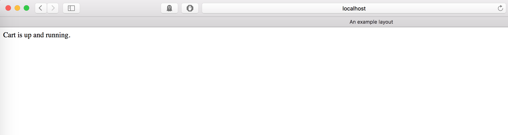

# Cart API

## Overview
This is a small Microservice example of simple Shopping Cart API endpoint to be used with [Shipped](http://shipped-cisco.com).

## Getting Started
1. Simple clone the repo or download the repo and cd into the repo and do `go run cart.go` to start the server on localhost.
2. Then run this simple curl command to make sure the service is up and running `curl -i http://localhost:8000` or view it on your web browser

```
Expected Result

HTTP/1.1 200 OK
Date: Tue, 19 Jan 2016 15:52:02 GMT
Content-Length: 160
Content-Type: text/html; charset=utf-8

<html>
  <head>
    <title>An example layout</title>
  </head>
  <body>

<p>Cart is up and running.</p>
<p>Try This command</p>
<p></p>

  </body>
</html>

```
or



## Endpoints
|URL | HTTP Verb | Functionality |
|:---:|:---:|:---:|
|/v1/cart/<itemID>| POST | Adds Item to cart |
|/v1/cart/<itemID>| DELETE | Deletes Item to cart |
|/v1/cart/| GET | List cart items |
|/v1/order/| GET | Send Order |
|/v1/order/| POST | Send Info |


----------------------------
- **POST /v1/cart/{item_id}**
```
curl -H "Content-Type: application/json" -X POST http://localhost:8888/v1/cart/{item_id}
Expected Result:
{
    "success":true,
    "item":{item_id},
    "message":"Added {name} to Cart"
}
```
- **DELETE /v1/cart/{item_id}**
```
curl -H "Content-Type: application/json" -X DELETE http://localhost:8888/v1/cart/{item_id}
Expected Result:
{
    "success":true,
    "item":{item_id},
    "message":"Deleted {name} from Cart"
}
```
- **GET /v1/cart/**
```
curl -H "Content-Type: application/json" -X GET http://localhost:8888/api/cart/
Expected Result
{
  "cart": [{
    "item_id": 1,
    "quantity": 1
  }]
}
```
- **GET /v1/order/**
```
curl -i -H "Content-Type: application/json" -X GET http://localhost:8888/v1/order/
Expected Result
{
  "cart": [{
    "item_id": 1,
    "quantity": 1
  }]
}
```
- **POST /v1/order/**
```
curl -i -H "Content-Type: application/json" -X POST -d '{"name":"nick","address":"example","card_number":0}' http://localhost:8001/v1/order/?mock=true
HTTP/1.1 202 Accepted
Content-Type: application/json
Date: Fri, 22 Jan 2016 17:56:52 GMT
Content-Length: 80
{
    "status": "SUCCESS",
    "code": 202,
    "message": "Order Info Saved!"
}
```
OR
```
curl -H "Content-Type: application/json" -X POST -d @orderExamplePost.json http://localhost:8001/v1/order/?mock=true
{
    "status": "SUCCESS",
    "code": 202,
    "message": "Order Info Saved!"
}
```

## Requirements
* [Go](https://github.com/golang/example)

## Credits
- [Nick Hayward](https://github.com/nehayward)
